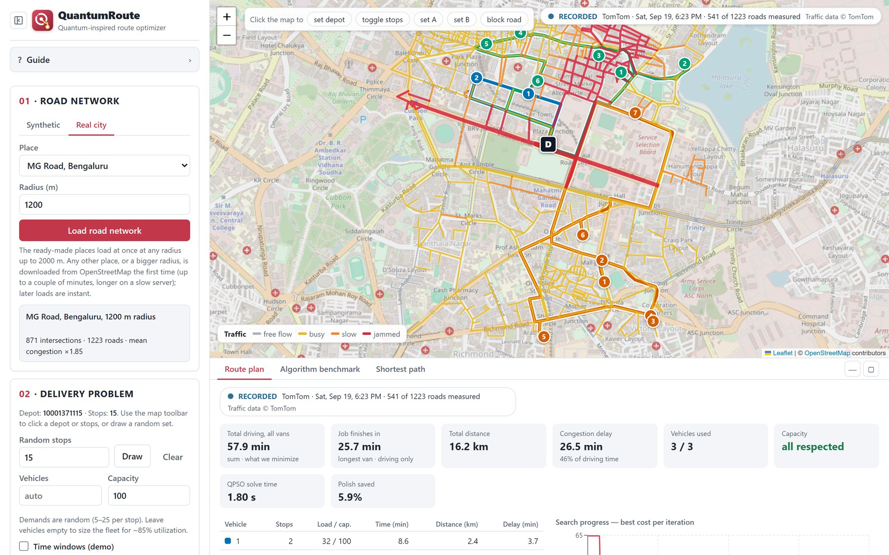

# QuantumRoute

**A quantum-inspired route optimizer for delivery fleets.** It plans routes for several vans on real city roads, and re-plans when traffic changes or a road closes.

Built for Smart India Hackathon 2026, problem SIH26137: *Quantum-Inspired Intelligent Traffic Route Optimization in Transportation Systems Using Metaheuristic Optimization* (problem set by Egreen Quanta).

**Live demo:** https://quantum-inspired-route-optimizer.onrender.com
(free hosting: the first visit can take about a minute to wake up, and only the four ready-made cities load there. Run it with Docker for everything.)



## What it does

- Plans routes for a fleet with van capacity and optional time windows, on a real OpenStreetMap road network (four ready-made Indian cities, or any place) or a synthetic city.
- Lets traffic change the plan: live TomTom readings, a recorded replay, simulated rush hour, or a closed road that every solver plans around.
- Minimizes travel time, distance, congestion delay, or a blend of the three.
- Solves with **QPSO**, the quantum-inspired core, next to PSO, a genetic algorithm, nearest neighbour and a route-search option. Also finds the shortest path between two places.
- Shows the routes on a map, a per-van table, the convergence curve and a side-by-side benchmark.

## Deliverables

Everything the problem statement's delivery table asks for is in this repository and running.

| Expected deliverable | What is here | Where |
|---|---|---|
| **1. Graph-based network model** | A directed weighted graph: intersections are nodes, roads are arcs with travel time, distance and congestion. Weights update from live, recorded or simulated traffic and from closed roads. | `backend/app/core/graph_model.py`, `traffic.py`, `live_traffic.py` |
| **2. Mathematical formulation** | Objective, capacity, time-window and flow constraints, decision variables, and every algorithm, written out. | [docs/MATH_FORMULATION.md](docs/MATH_FORMULATION.md) |
| **3. Quantum-inspired algorithm module** | QPSO with random-key route encoding, a sampled (velocity-free) update around an attractor, and an annealed contraction-expansion step. Plus a warm start and a polish. | `backend/app/core/qpso.py`, `vrp_formulation.py` |
| **4. Software platform** | A React map interface and a FastAPI REST API. Input a network and traffic, get optimized routes drawn on the map. | `frontend/`, `backend/app/api/` |
| **5. Demonstration** | Four real Indian cities (Delhi, Noida, Bengaluru, Mumbai), recorded and live TomTom traffic, a public site, and an end-to-end check that runs the demo scenes through the API. | [live site](https://quantum-inspired-route-optimizer.onrender.com), `backend/scripts/demo_rehearsal.py` |

The "expected solution" also asks for constraint handling, convergence analysis and systematic benchmarking:
capacity, time windows and closed roads are enforced and unreachable stops are reported; every run draws its convergence curve;
and the benchmarks (20 written findings, every result file in `backend/results/`) are in [docs/BENCHMARKS.md](docs/BENCHMARKS.md).

## Results

| Test | Result |
|---|---|
| QPSO vs classical PSO, 20 to 50 stops, raw output | 13.6 to 28.1% cheaper routes; QPSO wins 21 to 30 of 30 instances in every setting |
| 150 small problems with a computed exact optimum (route-search option) | optimal on 150 of 150 |
| 22 standard CVRPLIB instances, 100 to 199 customers (route-search option) | 2.9% above the proven optimum after 10 s, 1.5% after 2 min; OR-Tools after 60 s: 5.5% |
| Shortest path, Dijkstra as the exact reference | QPSO, PSO and GA find the exact route on 78 to 90% of pairs on a 40-intersection map |

We say where QPSO does not win. After the same local search, QPSO, PSO and the genetic algorithm end within about 1 to 3% of one another,
and the default QPSO pipeline averaged 10.2% above optimal on the 100 to 199 customer instances, which is why the route-search option exists.
The full write-up with every caveat: [docs/BENCHMARKS.md](docs/BENCHMARKS.md).

## Run it

**With Docker** (nothing else to install):

```bash
docker compose up --build
```

Open http://localhost:8000. If that port is taken: `PORT=8080 docker compose up --build`.

**Without Docker** (Python 3.11 and Node 20+):

```bash
cd backend
python -m venv .venv && source .venv/Scripts/activate    # macOS/Linux: source .venv/bin/activate
pip install -r requirements.txt
python -m uvicorn app.main:app --port 8000
```

```bash
cd frontend
npm install && npm run dev                                 # http://localhost:5173
```

Live traffic is optional: put `TOMTOM_API_KEY=...` in `backend/.env`. Without it the recorded MG Road traffic still works. Tests: `cd backend && python -m pytest tests -q` (431 tests).

## Try it in two minutes

1. **Road network**: open the *Real city* tab, choose *MG Road, Bengaluru*, press *Load road network*.
2. **Optimize routes**: routes appear on the map with each van's load, time and delay.
3. **Traffic**: under *Recorded traffic* press *Replay*. The same stops now take about twice as long, and the plan changes.
4. **Block a road**: press *block road* on the map toolbar and click a road the plan uses. A banner shows what the closure cost.
5. **Guide**: the button at the top of the sidebar explains every control, with screenshots.

## Documentation

| | |
|---|---|
| [docs/MATH_FORMULATION.md](docs/MATH_FORMULATION.md) | the problem, the cost function, each algorithm |
| [docs/BENCHMARKS.md](docs/BENCHMARKS.md) | every experiment, its numbers and its caveats |
| [docs/REFERENCE.md](docs/REFERENCE.md) | using each control, live-traffic setup, REST API, Docker and hosting, repository layout |

## Project layout

```
backend/    FastAPI app (app/core: graph, QPSO and other solvers, traffic; app/data: OSM and TomTom), scripts/, tests/, results/
frontend/   React + TypeScript + Leaflet map interface
docs/       mathematics, benchmarks, demo script, reference, deployment
Dockerfile  builds the interface and the backend into one image
```

## Credits

Map data © OpenStreetMap contributors (ODbL). Traffic data © TomTom. Place suggestions from Photon. Route solving and benchmarks are our own code; Google OR-Tools is used only as a reference to compare against.
